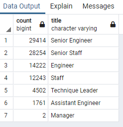

# Pewlett-Hackard-Analysis
Analysis using Postgre SQL Database and SQL Queries

## Overview of Project
**Using Postgre SQL query language to analyze company employee related data to future-proof the company by determining how many people will be retiring and, of those employees, who is eligible for a retirement package. This will help the company understand the scope and help them to plan for it.** 

*Some managers plan to introduce a mentoring program where experienced and successful employees would be stepping back into a part-time role instead of retiring completely. Their new role in the company would be as a mentor to the newly hired folks. (This requires addittional reports to be created)*

**The Analysis should include the following information:** 
*Pre-requisites: Postgre SQL DB has been created*

1. The Number of Retiring Employees by Title
2. The Employees Eligible for the Mentorship Program
3. A summary of findings and recommendations

## Resources
- Data Source (input and output csv files): [data](https://github.com/MonikaSData/Pewlett-Hackard-Analysis/tree/main/Data)
- Source Code: [Employee_Database_challenge](Queries/Employee_Database_challenge.sql)
- Software: PostgreSQL 12.5; PgAdmin 4; VS Code 2019

## Results
- **The Number of Retiring Employees by Title**
   - Total of 72,458 employees are currently employed by PH (fictional company for the use case) and qualify to retire
   - 7 different job roles (titles) will be impacted
  

- **Code Example:**
     
     *List of Retiring Employees by Title*

      -- List of employees unique titles that are retiring
        SELECT DISTINCT ON (e.emp_no) e.emp_no,
            e.first_name,
            e.last_name,
            t.title
        INTO unique_titles
        FROM employees as e
        INNER JOIN titles AS t
        ON (e.emp_no = t.emp_no)
        WHERE (e.birth_date BETWEEN '1952-01-01' AND '1955-12-31')
        ORDER BY e.emp_no, t.to_date DESC;

    *The Number of Retiring Employees by Unique Title*

      -- The number of unique titles for employees by their most recent job title who are about to retire
        SELECT COUNT(emp_no), title
        INTO retiring_titles
        FROM unique_titles
        GROUP BY title
        ORDER BY COUNT(emp_no) DESC;

- **The Employees Eligible for the Mentorship Program**
   - Total of 1549 employees are qualified under the current criteria to participate in the proposed mentorship program

- **Code Example:**
     
      -- List of employees titles that are retiring
        SELECT DISTINCT ON (e.emp_no) e.emp_no,
            e.first_name,
            e.last_name,
            e.birth_date,
            de.from_date,
            de.to_date,
            t.title
        INTO mentorship_eligibilty
        FROM employees as e
        INNER JOIN dept_employee AS de
        ON (e.emp_no = de.emp_no)
        INNER JOIN titles AS t
        ON (e.emp_no = t.emp_no)
        WHERE (e.birth_date BETWEEN '1965-01-01' AND '1965-12-31')
            AND (de.to_date = '9999-01-01')
            AND (t.to_date = '9999-01-01')
        ORDER BY e.emp_no;

## Summary

 1. How many roles will need to be filled as the "silver tsunami" begins to make an impact?
    - Total of 90398 of roles will be possibly need to be replaced (this is the number of employees that qualify to retire based on the SQL queries requested); out of which 72,458 are current employees
    - 7 different job roles (titles) will be impacted
 2. Are there enough qualified, retirement-ready employees in the departments to mentor the next generation of Pewlett Hackard employees?
    - Yes, there are plenty of current employees that would qualify to retire and mentor new employees. 
    - However; the number of current employees that would qualify under the current criteria for the mentorship program is far too few (1549). The program criteria should either be expanded or the company has to ensure that will have robust hiring strategy to fill in the gaps.

 **Recommendations: create two additional queries or tables to get more insight**
 1. Create list of employees that are eligible to retire by department (for all departments)
 2. Create list of employees that are eligible to participate in the mentorship program by department (for all departments)
 

  